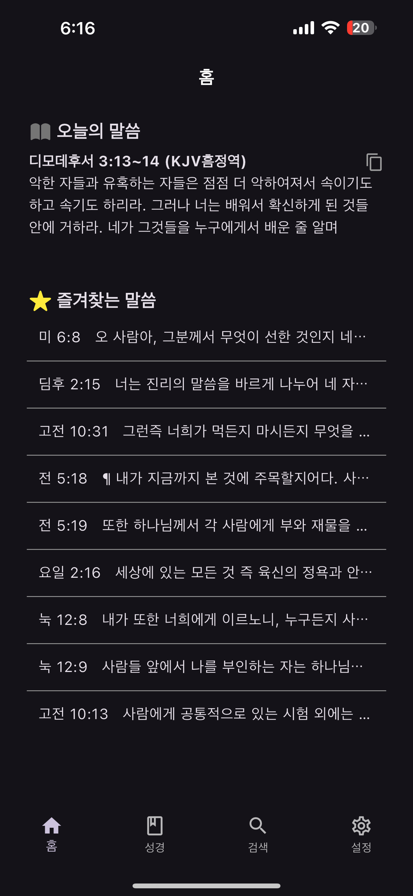
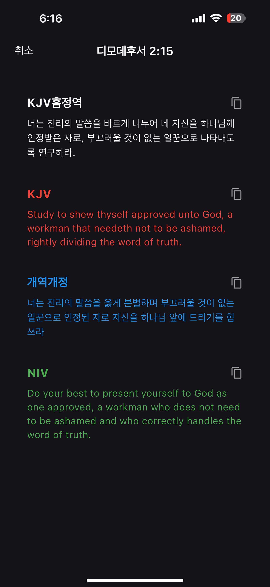
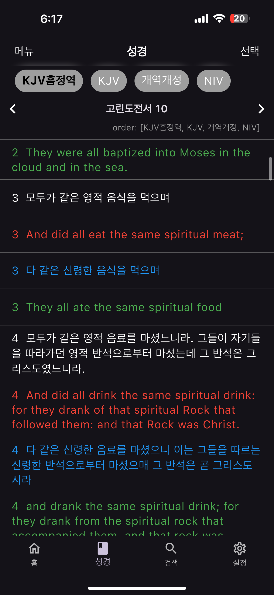
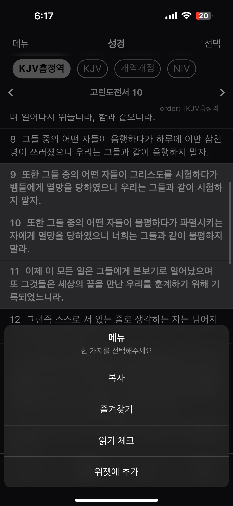
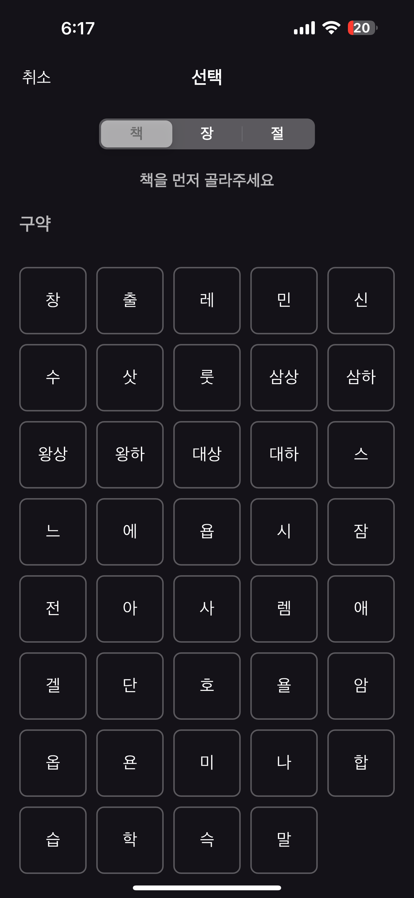
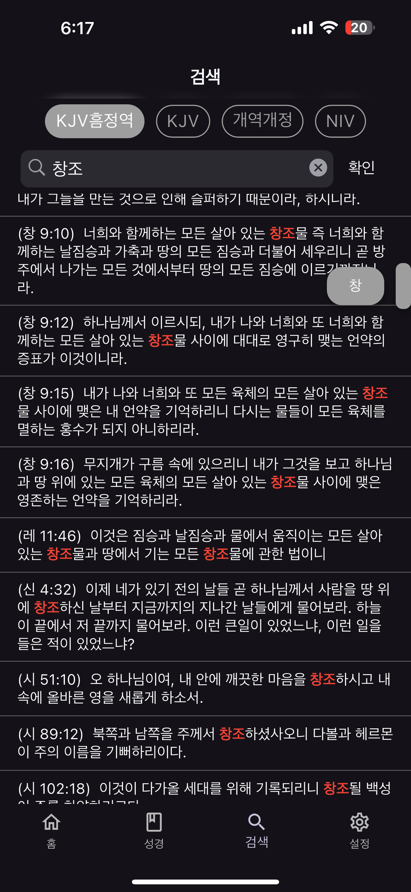
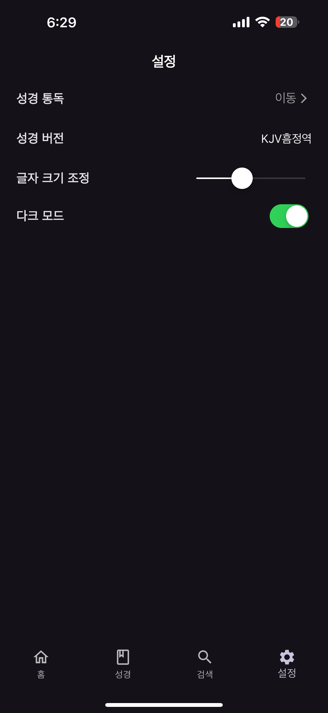
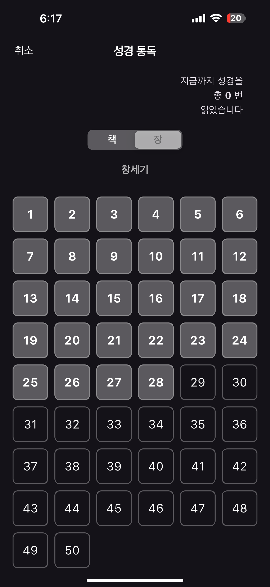

# LordBible_Flutter

## 프로젝트 개요

- KJV, NIV, 개역개정, KJV흠정역 제공하는 성경 어플리케이션

### 1. 주요 기능
- 4가지 버전의 성경말씀 제공 및 검색

#### 페이지 구조
- 홈(home)
    - 오늘의 말씀(랜덤)
    - 즐겨찾는 말씀
- 성경(bible)
    - 성경 말씀 버전
    - 말씀 즐겨찾기
    - 읽기 완료
    - 위젯 추가
- 검색(search)
    - 4가지 버전에서 특정 단어 검색 
- 설정(setting)
    - 읽은 말씀 목록
    - 성경 버전 선택
    - 글자 크기 조정
    - 다크 모드
- 위젯(widget)
    - 암송하고 싶은 성경 구절

### 2. 개발 일정

#### 2022.9.1~2022.11.10
| 항목           | 기간                      | 상태  |
|--------------|-------------------------|-----|
| 제공 서비스 선별/확립 | 2024/12/14              | 완료  |
| 모바일 설계       | 2024/12/15 – 2024/12/31 | 완료  |
| 테스트          | 2024/12/31 - 2025/01/05 | 완료  |
| 주변 지인에게 공유   | 2025/01/07 -            | 진행중 |
| 리팩토링         | 2025/01/15 - 2025/01/18 | 예정  |

## 프로젝트 실행

### 1. 요구 사항

#### iOS
- iOS >= 17
#### Android
- Android >= 14 (위젯)

### 2. 설치 방법

#### iOS
- simulator 또는 아이폰/아이패드에서 실행
#### Android
- simulator

## 최종 구현 화면

#### - 홈화면

  
  

#### - 성경말씀

  
  
  

#### - 검색

  

#### - 더보기

  
  

#### - 위젯

  

